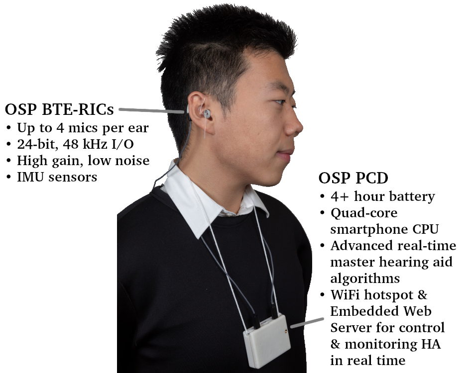
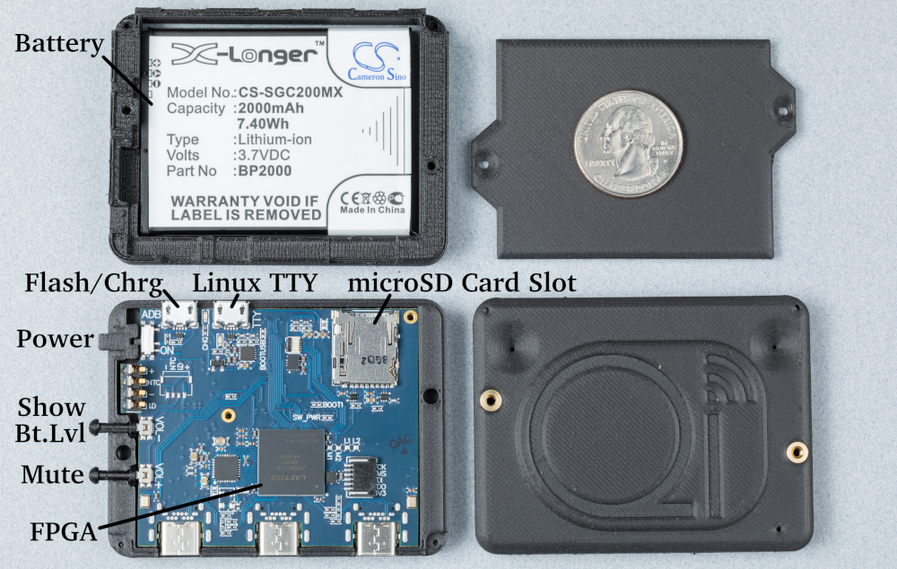
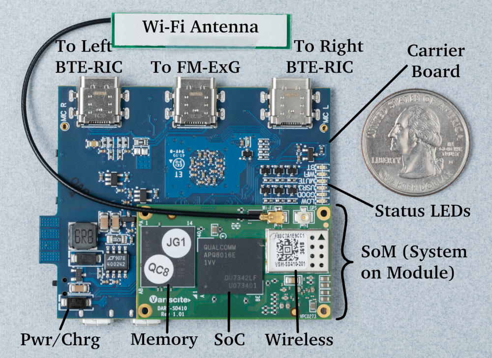
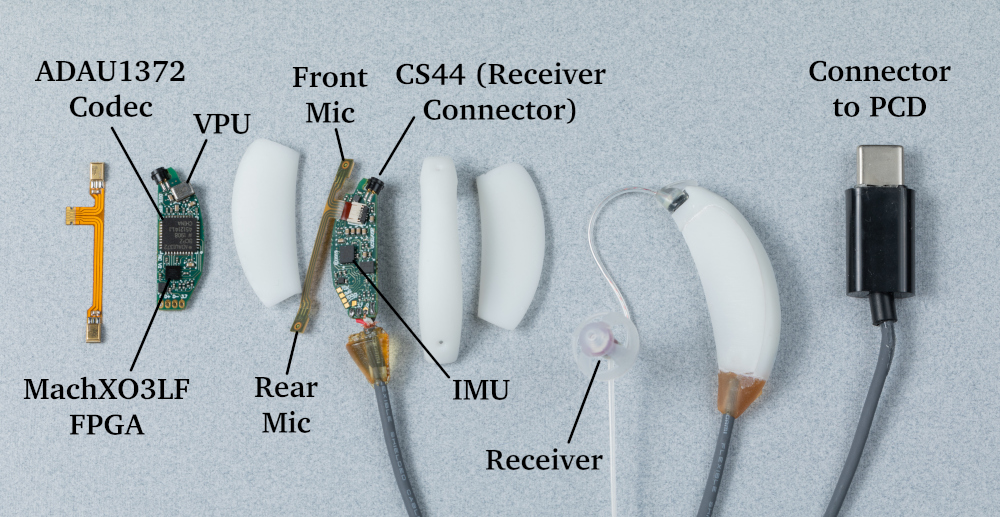

# Getting Started with OSP Devices
A Guide
Website: http://openspeechplatform.ucsd.edu/

## Abstract
This document describes how to set up and connect hardware devices to Open Speech Platform (OSP). This work is supported by:

* NIH  R33-DC015046:  Self-fitting  of  Amplification:  Methodology  andCandidacy
* NIH R01-DC015436:  A Real-time, Open, Portable, Extensible SpeechLab to University of California, San Diego.
* NSF IIS-1838830:  Division of Information & Intelligent Systems,  ”AFramework  for  Optimizing  Hearing  Aids  In  Situ  Based  on  PatientFeedback, Auditory Context, and Audiologist Input”
* The Qualcomm Institute  
  
Please visit [OSP Forum - Getting Started](http://openspeechplatform.ucsd.edu/forums/forum/getting-started/) to report issues and suggest improvements.

## Table of Contents
[1 Required Devices](#1-required-devices)  
* [1-1 The PCD \(Processing and Communication Device\)](#1-1-the-PCD-processing-and-communication-device)  
* [1\-2 BTE-RICs \(Behind-the-Ear, Receivers-in-Canal\)](#1-2-bte-rics-behind-the-ear-receivers-in-canal)  

[2 Installing Devices](#2-installing-devices)  
[3 Testing Devices](#3-testing-devices)  

&nbsp;
## 1 Required Devices
The OSP hardware is made of two main devices and one optional device. See figure [1.1](#figure1-1) below for a summary of #1 and #2.  

1. **The PCD (Processing and Communication Device)**  
The PCD is a small wearable box containing a smartphone chipset performing all the signal processing and wireless communication functions, plus the battery and supporting hardware. The PCD is roughly
73 × 55 × 20 mm, has a mass of roughly 83 grams, and is attached by wires to the BTE-RICs.
2. **BTE-RICs (Behind-the-Ear, Receivers-in-Canal)**  
These are "hearing aid"-style audio transducer devices that connect to the PCD via a 4-wire cable. They support 4 microphones and one receiver (loudspeaker) per ear, plus an accelerometer/gyroscope
(IMU) for measuring look direction and researching
mobility disorders. 
3. **"FM\-ExG" \(Optional\)**  
This is a set of active biopotential electrodes for
acquiring EEG or other electrophysiological signals,
daisy-chained together and connected to acquisition
hardware on the PCD via another 4-wire cable. This can run alongside hearing aid processing. 

 
<figure id="figure1-1">
    <figcaption class="figcaption">Figure 1.1: A user wearing the OSP wearable platform. The two hardware components shown are the BTE-RIC transducers and the PCD.</figcaption>
    
</figure>
 

### 1\-1 The PCD \(Processing and Communication Device\)
The PCD composes of the following parts. Refer to Figures [1.2](#figure1-2), [1.3](#figure1-3), and [1.4](#figure1-4).
  
<figure id="figure1-2">
    <figcaption class="figcaption">Figure 1.2: The OSP PCD disassembled, showing the battery, the back of the carrier board, and the plastic shell.</figcaption>
    
</figure>
 

| Part                                    | Description                                                                                                                                                                                                                                                                                                                                                                                                                                                                                                                                                                      |
|-----------------------------------------|----------------------------------------------------------------------------------------------------------------------------------------------------------------------------------------------------------------------------------------------------------------------------------------------------------------------------------------------------------------------------------------------------------------------------------------------------------------------------------------------------------------------------------------------------------------------------------|
| 2000 mAh smartphone-type Li-Ion battery | Adjacent to the carrier board, this part can be charged from a microUSB port or swapped out with a new battery.                                                                                                                                                                                                                                                                                                                                                                                                                                                                  |
| micro USB port, "adb"                   | Used for both charging the device and updating the linux kernel. ADB stands for Android Debug Port.                                                                                                                                                                                                                                                                                                                                                                                                                                                                              |
| micro USB port, "uart"                  | Used connect the port to the shell.                                                                                                                                                                                                                                                                                                                                                                                                                                                                                                                                              |
| USB-C port - "left"                     | Used to connect the PCD to the left receiver (BTE-RIC).                                                                                                                                                                                                                                                                                                                                                                                                                                                                                                                          |
| USB-C port - "right"                    | Used to connect the PCD to the right receiver (BTE-RIC).                                                                                                                                                                                                                                                                                                                                                                                                                                                                                                                         |
| USB-C port - "ephys"                    | An experimental port for OSP in-house development of EEG devices (used to connect to the FM-ExG); it has a high speed Analog-to-Digital Converter (ADC) that can be used for any analog devices.                                                                                                                                                                                                                                                                                                                                                                                 |
| Snapdragon 410c SoC (APQ8016)           | A single-board computer system, which has four 64-bit ARM A53 cores at 1.2 GHz, plus DSP and GPU.  Not only does a multicore CPU provide more processing power than a single-core CPU, it allows us  to assign real-time portions of the HA processing to dedicated cores where they will not be interrupted.    Key SoC peripherals include two multichannel inter-IC sound (MI2S) ports for audio I/O to the BTE-RICs  transducers; several SPI ports for peripheral control and communication; a microSD card for data logging;  and a UART for the Linux terminal interface. |

<figure id="figure1-3">
    <figcaption class="figcaption">Figure 1.3: Components of the OSP PCD (Processing and Communication Device): the carrier board hosting the Snapdragon 410c SoM.</figcaption>
    
</figure>
 
<figure id="figure1-4">
    <figcaption class="figcaption">Figure 1.4: Block diagram of the OSP PCD.</figcaption>
    
</figure>
  

I see two micro usb ports on the device labeled, "uart" and "adb". I take that uart usb port is to connect to shell over uart ? What's "adb" usb port for? **Uart is for the shell and ADB is for both charging the device and updating the linux kernel.**

I see 3 USB-C ports labeled, "left", "right" and "ephys". Left and Right ports are for connecting HA, what's "ephys" port used for? **EPhys is an experimental port for our in house development of EEG devices; it has a high speed ADC that can be used for any analog devices.**  
&nbsp;

### 1\-2 BTE-RICs \(Behind-the-Ear, Receivers-in-Canal\)
The BTE-RICs compose of the following parts. Refer to Figure [1.4](#figure1-4).
  
<figure id="figure1-5">
    <figcaption class="figcaption">Figure 1.5: The OSP BTE-RICs, together and disassembled.</figcaption>
    
</figure>
 

&nbsp;  

<!--<table class="tg yellowHighlight">
    <thead>
    <tr>
        <th class="tg-c3ow">Device</th>
        <th class="tg-c3ow">Description of device.</th>
        <th class="tg-c3ow">Image of Device</th>
    </tr>
    </thead>
    <tbody>
    <tr>
        <td class="tg-0pky">Device #1</td>
        <td class="tg-0pky">Description of device.</td>
        <td class="tg-0pky"></td>
    </tr>
    <tr>
        <td class="tg-0pky">Device #2</td>
        <td class="tg-0pky">Description of device.</td>
        <td class="tg-0pky"></td>
    </tr>
    </tbody>
</table>-->

&nbsp;
## 2 Installing Devices

**Necessary to include additional figures for the devices?**

**Disclaimer** \- The battery button is not functional currently, it may be operational in a future firmware update.  
1. Install Fastboot. **Comment\: Fastboot installation link? If there's a separate list of steps to ensure proper installation, this needs to be documented so people don't get tripped up by third-party documentation.**  
2. While device is off, plug in the USB cable into the ADB port (Android Debug Port). This enables you to charge and power up the device.
3. While pressing and holding the mute button, turn on the device.

There're also two LED indicators with "battery" and "speaker" sign. It doesn't light up as I turn on the device, is this behavior normal? **If there is a green light constantly on then the hearing aids are muted, in order to unmute press the speaker button. See disclaimer regarding the battery button.**

4. Open up the terminal and type in `fastboot devices`. It should display one line and the ID of the device, meaning you successfully booted it up in Fastboot mode. **Could include terminal output to show, rather than tell, how this command would be successfully executed?**
5. Grab two files: one labeled _boot-v7.img_, the other labeled _rootfs.simg_. **(location is TBD, on Bitbucket[up to date]/GitHub) Where should they retrieve these files, GitHub or Bitbucket?**
6. Go to the folder that has these two files and run the following commands in order: `fastboot flash boot boot-v7.img`\, `fastboot flash rootfs rootfs.simg` **How does a person know that the terminal executed properly without errors/issues?**
7. Once completed, restart the device with the headsets plugged in. **Headsets meaning the BTE-RICs? Plugged into the audio jack of the computer? Unclear here.**
8. After boot, everything should be working, but it might take a moment. **What does after boot mean?**
9. Then, you should see a hotspot called "ospboard". Enter the password "hearingaid" to connect to the hotspot.

**Logging through hotspot or internet. Would this occur after step \#9?**
By default, SSH is disabled. You need to enable this via uart connectivity (auto-login as root) Login credentials are the following: username and password are both "linaro".

10. Go to your browser, and enter "192.168.8.1:5000". You should see the Node.js pages. To visit the PHP pages, remove ":5000".
11. Login to researcher page, change the gains to see effects on BTE-RICs. **Logging in to researcher page only applies to Node.js, not PHP version of EWS. For testing purposes, would we prompt the person to refer to Section 1.4 and Chapter 2 in the separate EWS Getting Started Guide?**
12. Confirm things are functioning, test to see if things are functioning. **Need a list of steps to elaborate what "things" need to be tested.**

<mark class="yellowHighlight">
    Describe steps needed to install the devices.
    <ol class="yellowHighlight">
        <li>Important disclaimers if there are parts of the device(s) that are not functioning at the moment, which will be fixed in the future (such as the "battery" buttons?)</li>
        <li>Powering on the device by charging it?</li>
        <li>Bringing up the hotspot, which should say "ospboard" and connecting it using the linaro username and password?</li>
        <li>Wired connectivity between left and right USB C-ports and the hearing aids?</li>
    </ol>
</mark>

<mark class="yellowHighlight">Topics Related to Dhruv's Questions and Dhiman's Answers
</mark>

&nbsp;
## 3 Testing Devices
<mark class="yellowHighlight">Describe steps needed to test the devices.</mark>

**Second section: "How to do more with the device." Would this be part of testing or a continuation of the installation process?**  
To do more with the devices, following these steps.

1. Connect the USB cable to the uart (universal asynchronous receive transmit) port.
2. Using your favorite terminal command to connect to comm. devices. "screen" (there's a bunch of them). Will have to figure out the port number ("/dev/ttyUSBX" for Linux, where "X" is the port number) **This step needs more explanation, probably will revisit the recording.**
3. Baud rate: "115200" (example for "screen", it would be "screen /dev/ttyUSBX 115200") **Revisit recording.**
4. Once you've established connection, you will be logged in as root.
5. Source code for OSP is located at /root/osp-release-staging/. **Where does this become relevant in this section?**

**Switching to Network Mode**
6. If you want to switch the unit over to network mode, they need to "set_mode nm". This will restart the device, upon restart, goes to Network Management mode.
7. Command `nmtui` to set up the wifi.
8. After connecting to wifi, update the source code if needed and do other tasks depending if it needs internet or not. **What are these tasks?**

**Changing Hotspot SSID Name**
8. To change the hotspot SSID name, edit this file: `/etc/hostapd/hostapd.conf`
9. In order to go to hotspot mode: run `set_mode hs`