# OSP \- EWS Getting Started Guide - Release 2020a
Website: http://openspeechplatform.ucsd.edu/

## Abstract
This document describes steps to download, build, install and test the browser-based Embedded Web Server (EWS) for the Open Speech Platform (OSP) Release 2020a software. This work is supported by:

* NIH  R33-DC015046:  Self-fitting  of  Amplification:  Methodology  andCandidacy
* NIH R01-DC015436:  A Real-time, Open, Portable, Extensible SpeechLab to University of California, San Diego.
* NSF IIS-1838830:  Division of Information & Intelligent Systems,  ”AFramework  for  Optimizing  Hearing  Aids  In  Situ  Based  on  PatientFeedback, Auditory Context, and Audiologist Input”
* The Qualcomm Institute  
  
Please visit [OSP Forum - Getting Started](http://openspeechplatform.ucsd.edu/forums/forum/getting-started/) to report issues and suggest improvements.

## Table of Contents
[1 Release 2020a Installation](#1-release-2020a-installation)   
* [1\-1 Requirements for OSP](#1-1-requirements-for-osp)
    * [1\-1\-1 Computer Requirements](#1-1-2-computer-requirements)
    * [1\-1\-2 Installation Requirements](#1-1-3-installation-requirements)
* [1\-2 Download Files from OSP](#1-2-download-files-from-osp)
* [1\-3 Choosing the Installation Method](#1-3-choosing-the-installation-method)
    * [1\-3\-1 Installing Everything \- RT\-MHA and Node\.js version of EWS](#1-3-1-installing-everything---rt-mha-and-nodejs-version-of-ews)
    * [1\-3\-2 Installing Everything \- RT\-MHA and PHP version of EWS](#1-3-2-installing-everything---rt-mha-and-php-version-of-ews)
    * [1\-3\-3 Installing/Updating just the RT\-MHA](#1-3-3-installingupdating-just-the-rt-mha)
    * [1\-3\-4 Installing/Updating just the Node\.js version of EWS](#1-3-4-installingupdating-just-the-nodejs-version-of-ews)
    * [1\-3\-5 Installing/Updating just the PHP version of EWS](#1-3-5-installingupdating-just-the-php-version-of-ews)  
* [1\-4 Connecting Your Audio Device](#1-4-connecting-your-audio-device)
    * [1\-4\-1 On Mac Computers](#1-4-1-on-mac-computers)
    * [1\-4\-2 On Linux Computers](#1-4-2-on-linux-computers)

[2 Release 2020a Package Testing and Validation](#2-release-2020a-package-testing-and-validation)
* [2\-1 Test RT\-MHA](#2-1-test-rt-mha)
* [2\-2 Test EWS \(Node\.js Version\)](#2-2-test-ews-nodejs-version)  
* [2\-3 Test EWS \(PHP Version\)](#2-3-test-ews-php-version)  

[3 Release 2020a Development\: EWS \(Node\.js version\)](#3-release-2020a-development-ews-nodejs-version)

&nbsp;  
## 1 Release 2020a Installation
##### \[[back to table of contents](#table-of-contents)]
&nbsp;   
This section goes over what is required to install the Open Speech Platform software and what are the steps needed for the different installation methods.  The installation process of OSP may take around 30−90 minutes, depending on your computer, download speeds over the internet, and any installation errors that you may encounter and resolve.

&nbsp;   
### 1\-1 Requirements for OSP
&nbsp;

#### _1\-1\-1 Computer Requirements_
In order to use OSP, you must use either a Mac or a _debian-based_ Linux
machine (such as Ubuntu or Linaro) with the following processing, memory,
and storage requirements. Figures [1.1](#figure1-1) and [1.2](#figure1-2) provide a reference for these
requirements.

1. **Processor**: Equivalent to an Intel Core i5 processor.
2. **Memory/RAM**: At least 8GB or more.
3. **Free Storage Space**: At least 2GB or more

<figure id="figure1-1">
    
    <figcaption class="figcaption">Figure 1.1: Example of system requirements for a MacOS computer.</figcaption>
</figure>
<figure id="figure1-2">
    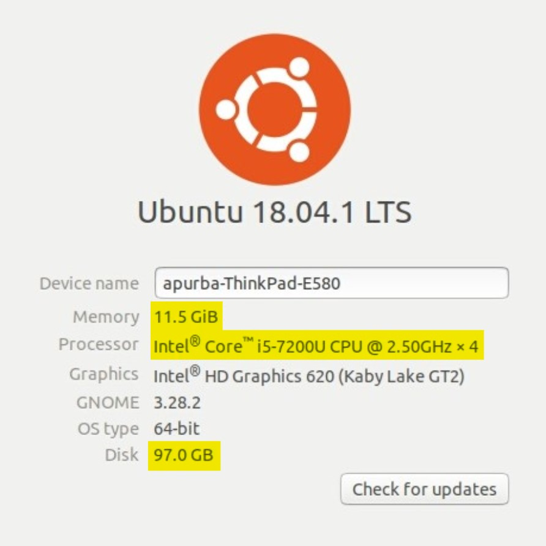
    <figcaption class="figcaption">Figure 1.2: Example of system requirements for a Linux computer on Ubuntu.</figcaption>
</figure>

To check if your computer meets these specifications...
* **On Mac**, click on the Apple menu icon at the top of your screen. In the
dropdown menu, choose "About This Mac". The specifications should
look similar to Figure [1.1](#figure1-1). For more information, see how [Apple explains
computer specifications](https://support.apple.com/en-us/HT203001).
&nbsp;
* **On Linux**, you may need to use a terminal that accepts command
lines to figure out the specifications. Figure [1.2](#figure1-2) is a reference of what
the specifications look like on Ubuntu 18.04.1, though this may appear
differently for different Linux systems. You check out this Stack Exchange
post for answers related to Ubuntu: [askUbuntu - How do I check system
specifications?](https://askubuntu.com/questions/55609/how-do-i-check-system-specifications)

After the installation, to verify that the system can deliver audio output,
**you need some way to input and output audio**. Ideally, a working
device such as a headset or pair of headphones would be used, but your
computer’s built-in microphone and speakers are good enough as long as the
volume settings are not set to mute.
#### _1\-1\-2 Installation Requirements_
Finally, these are the additional applications and tools needed to successfully
install OSP
* **Command Terminal**: You will need to know how to operate the
command terminal with working knowledge of basic terminal commands
and features. This is to navigate through different folders and operate
OSP after installation. Fortunately, this guide will cover all of the
commands needed, as long as you follow the steps in order.
* **GitHub and git**: Our files are stored online via our GitHub page.
You will need to install git within the terminal, if this hasn’t been
done already.

&nbsp;
### 1\-2 Download Files from OSP

<mark class="yellowHighlight"><b>From the original Getting Started Guide</b></mark>  
<ol>
    <li><b>Open the terminal application.</b></li>
        <ol class="letteredList">
            <li>On Mac, you can go to <code>Applications</code> within your Finder and type in the search bar "terminal". It should appear as a thumbnail that looks like a black box</li>
            <li>On Linux, there are many methods to open the terminal. An article on How-To Geek’s website covers this:<a href="hhttps://www.howtogeek.com/howto/22283/four-ways-to-get-instant-access-to-a-terminal-in-linux/" target="_none"> Four Ways to get Instant Access to a Terminal in Linux.</a></li>
            <li><mark class="yellowHighlight"><b>Below are the steps that need to be reworked (from Martin's feedback).</b></mark></li>
            <li><mark class="yellowHighlight">In the terminal, enter the command <code>cd /</code>. This will navigate you to the root directory</mark></li>
            <li><mark class="yellowHighlight">Try to enter the command <code>ls</code>, which shows a list of folders within the directory that you’re in and help you assess whether you’re in the correct directory.</mark></li>
            <li><mark class="yellowHighlight">For now, it is recommended that you navigate to the <code>Downloads</code> directory, which is where the installation files will be located. For Finder in macOS or File Manager in Linux, check where the Downloads directory is and see what order of the directory names are listed. Enter the command <code>cd (name1)/</code>, where (name1) is the directory that you want to navigate to (for example, you would enter <code>cd Downloads/)</code></mark></li>
            <li><mark class="yellowHighlight">Repeatedly enter the <code>ls</code> and <code>cd (name1)/</code> commands as necessary until you are in the <code>Downloads</code> folder.</mark></li>
        </ol>
    <li><mark class="yellowHighlight"><b>Martin's feedback: Why did we install git?</b><br></mark><s><b>Install git.</b> By now, you should be in the Downloads directory in your terminal. If you already have git installed in your computer, skip this step and proceed to step 3. If not, follow these steps:</s></li>
        <ol class="letteredList">
            <s>
            <li>Type in <code>sudo apt-get install git</code> to install git in your computer.</li>
            <li>For Mac systems, you can install git from the following link: <a href="https://sourceforge.net/projects/git-osx-installer/files/" target="_none">https://sourceforge.net/projects/git-osx-installer/files/</a></li>
            </s>
        </ol>
    <li>
        <b>Download the 2020a Release from GitHub</b>: On your browser, navigate to <a href="https://github.com/nihospr01/OpenSpeechPlatform-UCSD" target="_none">https://github.com/nihospr01/OpenSpeechPlatform-UCSD</a> to download the latest release. Press the "Clone or download" button in GitHub. You can either "clone the software on your computer" or "download ZIP file to your computer."
        <ol class="letteredList">
            <li>
                <b>Use the </b><code>git clone</code><b> method.</b>
                <br>
                If you wish to clone, click on the button to the right of the text (it should look like a clipboard, see Figure <a href="#figure1-3">1.3</a>. This would copy the line of code.
                <figure id="figure1-3">
                    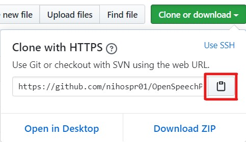
                    <figcaption class="figcaption">Figure 1.3: If you are using the <code>git clone</code> method, click on this button (outlined in red). This will copy the line of code, which you will paste into the terminal.</figcaption>
                </figure>
                <br>
                Navigate to the Downloads directory using the commands <code>cd (name1)/</code> and <code>ls</code> commands outlined in Step 1, if you haven’t already. Below is the resulting output, as files for OSP should be downloading.<br><br>
                <samp>
                    git clone https://github.com/nihospr01/OpenSpeechPlatform-UCSD.git<br>
                    Cloning into 'OpenSpeechPlatform-UCSD'...<br>
                    remote: Enumerating objects: 7909, done.<br>
                    Receiving objects: 6% (535/7909), 238.29 MiB | 373.00 KiB/s
                </samp>
                <br>
                <br>
                 This process will take a considerable amount of time, depending on your internet download speed.
                <br>
                <br>
            </li>
            <li>
                <b>.zip file method</b>: From the "Clone or download" button, click on "Download Zip" (you may refer back to Figure 1.3). You may need to wait a few moments before the browser prompts you to download the .zip file, which should have "OpenSpeechPlatform" attached to its name.
                <ol class="romanNumeralList">
                    <li><b>MacOS computers</b> support opening .zip files. Once you download the .zip file, go to the "Downloads" within Finder and open the .zip file. It should appear unzipped as a folder with the same name.</li>
                    <li>For <b>Debian-based Linux computers</b>, go to the terminal and enter <code>sudo apt install unzip</code>. <mark class="yellowHighlight"><b>What does this do?</b></mark><s>may need a third-party application (such as <a href="https://www.7-zip.org/download.html" target="_none"> 7-Zip</a>) to open the .zip file. Extract the folder within the .zip file and move it to an appropriate place within the file manager application.</s></li>
                </ol>
            </li>
        </ol>
    </li>
    <li>After doing the git clone command or downloading and extracting the .zip file, enter the command <code>cd OpenSpeechPlatform-UCSD/Software/Build-Scripts</code>, to navigate to a folder named "Build-Scripts" before proceeding to the next steps of the installation. You will install OSP’s software packages needed within this folder. Depending on your use, you will have multiple options and flexibility with regards to installation.</li>
</ol>

<mark class="yellowHighlight"><b>Martin's Notes for Zip File method of installation</b></mark>  
Go to this link to OSP GitHub page: https://github.com/nihospr01/OpenSpeechPlatform-UCSD

Then download the zip file, see the GIF below:

<!---->
<mark class="yellowHighlight">Need the GIF file.</mark>


The zip file will be downloaded to your `Downloads` directory.  Open a terminal
and unzip it.  (If `unzip` is not installed, you can install it with
`sudo apt install unzip`)

```
> unzip ~/Downloads/OpenSpeechPlatform-UCSD-master.zip 
Archive:  /home/mmh/Downloads/OpenSpeechPlatform-UCSD-master.zip
2f0d1eb27751e6a31be637c7f63eb9a9cbe5efb0
   creating: OpenSpeechPlatform-UCSD-master/
  inflating: OpenSpeechPlatform-UCSD-master/.gitignore  
...
```

Now go into the directory and install the software

```
> cd OpenSpeechPlatform-UCSD-master/Software/Build-Scripts/
~/OpenSpeechPlatform-UCSD-master/Software/Build-Scripts 
> ./install_all_php
[follow directions]
 ~/OpenSpeechPlatform-UCSD-master/Software/Build-Scripts 
> ./install_all_njs 
[follow directions]
```

This will install the PHP and Nodejs web apps in /usr/local.  You will be prompted
for your password so the installation script can write into that directory.
<mark class="yellowHighlight"><b>End of Martin's notes?</b></mark>

&nbsp;
### 1\-3 Choosing the Installation Method
Defined below are two main components of OSP.  
* **Real Time Master Hearing Aid (RT-MHA)** - This is the hearing
aid algorithm which takes the audio from the environment and modifies
it for the listeners specific prescription.
* **Embedded Web Server (EWS)** - This is a process, represented as a graphical user interface on any web browser enabled device which can control the RT-MHA algorithm. There are two flavors of EWS available in this release written in two different programming languages. The NodeJS version is currently being developed and will replace all of the functionality found in the PHP version.

Below are the available options to go about the installation process.
1. [**Installing Everything - RT-MHA and Node\.js version of EWS**](#1-3-1-installing-everything---rt-mha-and-nodejs-version-of-ews) 
This is the latest version of OSP. Future releases will completely adopt
Node.js.
2. [**Installing Everything - RT-MHA and PHP version of EWS**](#1-3-2-installing-everything---rt-mha-and-php-version-of-ews)
This is the legacy version of OSP, which will eventually not be used in
future releases. This version still has the \Goldilocks" page.
3. [**Installing/Updating just the RT-MHA**](#1-3-3-installingupdating-just-the-rt-mha)
4. [**Installing/Updating just the Node\.js version of EWS**](#1-3-4-installingupdating-just-the-nodejs-version-of-ews)
5. [**Installing/Updating just the Node\.js version of EWS**](#1-3-5-installingupdating-just-the-php-version-of-ews) 

Before you beginning any of these installation methods, here are additional disclaimers:
* In the terminal, **be sure that you have already navigated to
the** `Build-Scripts` **directory**. Otherwise you will not be able to
properly install the files. The file path to the `Build-Script` directory
should be `OpenSpeechPlatform-UCSD/Software/Build-Scripts/`, (see Step 4 of Section 1.2).
* **If you are using Ubuntu, you may have to manually install
the latest version of a software package related to Node.js
called** `node-pre-gyp` as well as the `npm` package** to resolve
installation issues and error messages in advance. This step will eventually be fixed in a future release
&nbsp;
#### _1\-3\-1 Installing Everything \- RT\-MHA and Node.js version of EWS_

<ol>
    <li>Run the command <code>./install_all_njs</code>, which does the following:</li>
        <ol class="letteredList">
            <li>Identify the operating system (OS) on your computer { currently OS X, Debian and Redhat/Fedora based Linux (It will work with apt-get and yum package managers).</li>
            <li>Install all the prerequisite software packages.</li>
            <li>Build and install RT-MHA as well as the Node.js version of EWS.</li>
        </ol>
    <li>To check whether the system has successfully installed in your system:
        <ol class="letteredList">
            <li>In the current terminal, run <code>osp</code>, this should start running the OSP.</li>
            <li>In a separate terminal run <code>ews-backend</code>. This should start running the backend of the Node.js version of EWS, this backend will also have the frontend built-in.</li>
            <li>Open a Browser window and type the URL <a href="localhost:5000" target="_none">localhost:5000</a>. This will open the webpage to the NodeJS version of EWS.</li>
        </ol>
    </li>
</ol>

&nbsp;
#### _1\-3\-2 Installing Everything \- RT\-MHA and PHP version of EWS_

<ol>
    <li>Run the command <code>./install_all_php</code>, which does the following:</li>
        <ol class="letteredList">
            <li>Identify the operating system (OS) on your computer { currently OS X, Debian and Redhat/Fedora based Linux (it will work with apt-get and yum package managers)</li>
            <li>Install all the prerequisite software packages.</li>
            <li>Build and install RT-MHA as well as the PHP version of EWS.</li>
            <li>Finally, it installs osp in <code>/usr/local/bin/osp</code> and a script to invoke ews in <code>/usr/local/bin/ews</code>.</li>
        </ol>
    <li>To check whether the system has successfully installed in your system:
        <ol class="letteredList">
            <li>In the current terminal, run <code>osp</code>, this should start running the OSP.</li>
            <li>In a separate terminal run <code>ews</code>. This should start running the PHP version of EWS.</li>
            <li>Open a Browser window and type the URL <a href="localhost:8080" target="_none">localhost:8080</a>. This will open the webpage to the PHP version of EWS.</li>
        </ol>
    </li>
</ol>

&nbsp;
#### _1\-3\-3 Installing/Updating just the RT\-MHA_

1. **This step is only needed if you are installing RT-MHA for the first time.** Run the command `./pre_req_all`, which command will identify your OS install all the necessary prerequisite packages in your system.
2. Run the command `./libosp`, which installs the librtmha and RT-MHA in your system.
3. To check whether the RT-MHA has successfully installed in your system, In the current terminal, run `osp`, this should start running the RT-MHA.

&nbsp;
#### _1\-3\-4 Installing/Updating just the Node.js version of EWS_

1. **This step is only needed if you are installing this version of EWS for the first time.** Run the command `./pre_req_all`. This command will identify your OS install all the necessary prerequisite packages in your system
2. Run the command `./ews_njs`. This will install the Node.js version of EWS on your system.
3. To check the EWS installation run `ews-backend` on the terminal, You can open a Browser window and type the URL [localhost:5000](localhost:5000). This will open the webpage to the Node.js version of EWS.

&nbsp;
#### _1\-3\-5 Installing/Updating just the PHP version of EWS_

1. **This step is only needed if you are installing this version of EWS for the first time.** Run the command `./pre_req_all`. This command will identify your OS install all the necessary prerequisite packages in your system
2. Run the command `./ews_php_public`. This will install the PHP version of EWS on your system.
3. To check the frontend run `ews` on the terminal, You can open a Browser window and type the URL [localhost:8080](localhost:8080). This will open the webpage to the PHP version of EWS.

&nbsp;
### 1\-4 Connecting Your Audio Device 
**Note**: For Mac computers, the default audio input and output built into
the computer is sufficient for testing the audio. You do not have to follow these steps to connect your audio device, but it is recommended to do so.

In your terminal, run the command `osp`, which implements the RT-MHA functions.  You can run it from any directory.
```
~/OpenSpeechPlatform-UCSD-master > osp
Done
Done
TCP Server created
ALSA lib pcm_dsnoop.c:641:(snd_pcm_dsnoop_open) unable to open slave
ALSA lib pcm_dmix.c:1089:(snd_pcm_dmix_open) unable to open slave
ALSA lib pcm.c:2642:(snd_pcm_open_noupdate) Unknown PCM cards.pcm.rear
ALSA lib pcm.c:2642:(snd_pcm_open_noupdate) Unknown PCM cards.pcm.center_lfe
ALSA lib pcm.c:2642:(snd_pcm_open_noupdate) Unknown PCM cards.pcm.side
ALSA lib pcm_oss.c:377:(_snd_pcm_oss_open) Unknown field port
ALSA lib pcm_oss.c:377:(_snd_pcm_oss_open) Unknown field port
ALSA lib pcm_usb_stream.c:486:(_snd_pcm_usb_stream_open) Invalid type for card
ALSA lib pcm_usb_stream.c:486:(_snd_pcm_usb_stream_open) Invalid type for card
ALSA lib pcm_dmix.c:1089:(snd_pcm_dmix_open) unable to open slave
Input device # 10
  Name: default
  Channels = 2
  LL: 0.00868481 seconds
  HL: 0.0348073 seconds
Output device # 10
  Name: default
  Channels = 2
  LL: 0.00868481 seconds
  HL: 0.0348073 seconds

Input latency: 0.002
Output latency: 0.003
```

At this point, you should be able to talk into your microphone and hear the sound played back in your headset (or computer speakers) with a very small delay.  If that does not happen, something is wrong. Hit Control-C on your keyboard a couple of times to exit OSP. Run `osp` again within your terminal to restart it.

If, after several tries, if it does not start, you need to check what audio input and output you want to use.  `osp` attempts to use the Linux system defaults. You can run the `pa_devs` command to get a detailed list of inputs and outputs available on your system.

To change the input and output to connect OSP with:
1. **On MacOS**\: Run the command `osp --input channel x --output channel y`, where `x` is the number associated with the input channel and `y` is the number associated with the output channel.
2. **On Linux**\: Run the command `osp --input device x --output device y`, where `x` is the number associated with the input device and `y` is the number associated with the output device.


When you know what device you want to use, you can rerun `osp` with those devices.

```
> osp --input_device 9 --output_device 9
TCP Server created
ALSA lib pcm_dsnoop.c:641:(snd_pcm_dsnoop_open) unable to open slave
ALSA lib pcm_dmix.c:1089:(snd_pcm_dmix_open) unable to open slave
ALSA lib pcm.c:2642:(snd_pcm_open_noupdate) Unknown PCM cards.pcm.rear
ALSA lib pcm.c:2642:(snd_pcm_open_noupdate) Unknown PCM cards.pcm.center_lfe
ALSA lib pcm.c:2642:(snd_pcm_open_noupdate) Unknown PCM cards.pcm.side
ALSA lib pcm_oss.c:377:(_snd_pcm_oss_open) Unknown field port
ALSA lib pcm_oss.c:377:(_snd_pcm_oss_open) Unknown field port
ALSA lib pcm_usb_stream.c:486:(_snd_pcm_usb_stream_open) Invalid type for card
ALSA lib pcm_usb_stream.c:486:(_snd_pcm_usb_stream_open) Invalid type for card
ALSA lib pcm_dmix.c:1089:(snd_pcm_dmix_open) unable to open slave
Input device # 9
  Name: pulse
  Channels = 2
  LL: 0.00868481 seconds
  HL: 0.0348073 seconds
Output device # 9
  Name: pulse
  Channels = 2
  LL: 0.00868481 seconds
  HL: 0.0348073 seconds

Input latency: 0.002
Output latency: 0.003
```

As an example, Figure [1.4](#figure1-4) shows the command issued as `osp --input device 6 --output device 6` on a Linux terminal, where `6` is the value associated to the connected audio device.

<figure id="figure1-4">
    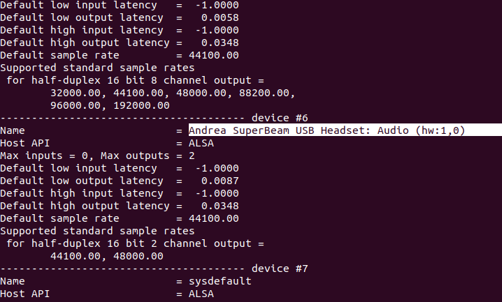
    <figcaption class="figcaption">Figure 1.4: List of devices displayed by running the <code>pa_devs</code> command.</figcaption>
</figure>

&nbsp;  
## 2 Release 2020a Package Testing and Validation
##### \[[back to table of contents](#table-of-contents)]
This chapter describes how to check that the installed software package(s) for OSP are working properly.

&nbsp;    
### 2\-1 Test RT\-MHA
You can interact with RT-MHA from the command line interface (CLI) to display and change the HA state. **Please make sure that the audio device is connected and that you can hear sound from the device. Otherwise, go back to section 2.1 to connect the device.**

<ol>
    <li>Do not wear the audio device for now.</li>
    <li>Open or navigate to your terminal and enter the command osp. The terminal should show results similar to Figure <a href="#figure2-4">2.4</a>
        <figure id="figure2-4">
            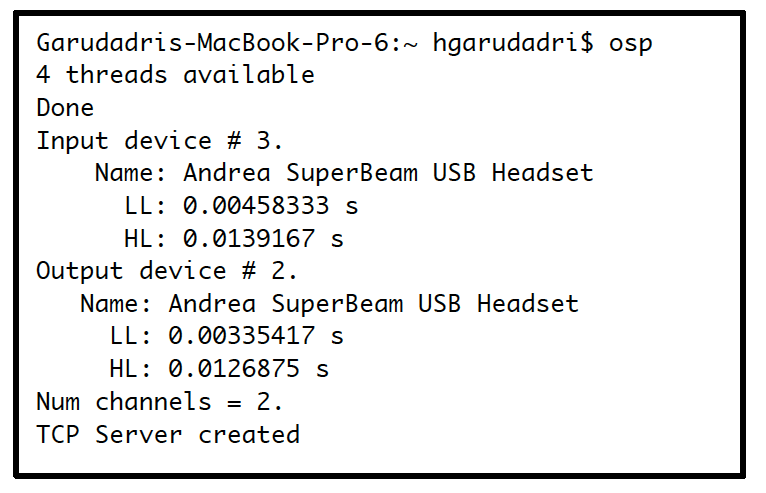
            <figcaption class="figcaption">Figure 2.4: Output of the terminal when you issue <code>osp</code> command.</figcaption>
        </figure>
    </li>
    <li>To familiarize you with the initial commands that OSP has, please
enter the following series of commands and steps in the terminal.</li>
        <ol class="letteredList">
            <li><code>-p</code> This command will print the <i>complete state</i> of RT-MHA. In the terminal messages above, notice that the gain on the left and right channels is -20 dB, to account for overall gain of RT-MHA.</li>
            <li><code>--gain -15</code> This command, with a value of -15, will set the system volume to -15 dB. By default, the gain is set to -20 dB. By entering this command, you are making RT-MHA louder by 5 dB. The -15 value can be changed to a different value.</li>
            <li>Type in <code>-p</code> to see the changed gain values. Your terminal should look similar to Figure <a href="#figure2-5">2.5</a>.
                <figure id="figure2-5">
                    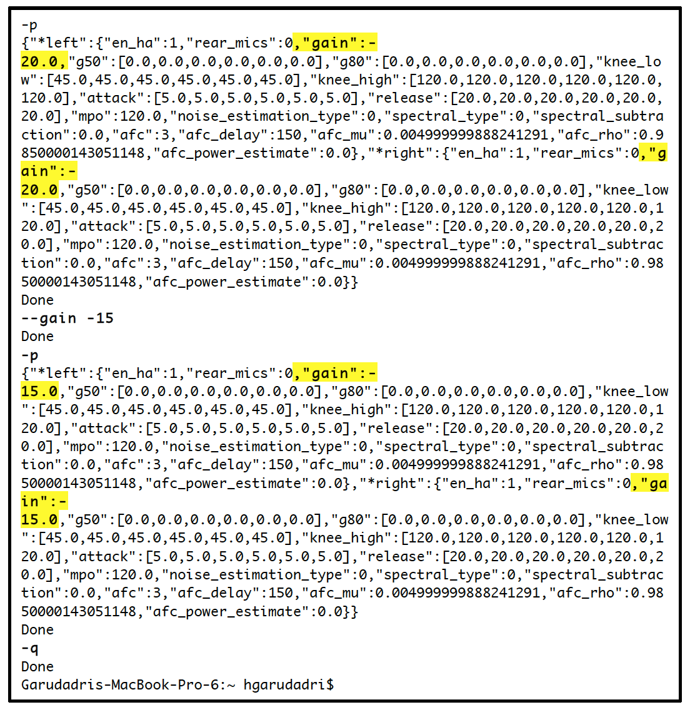
                    <figcaption class="figcaption leftAlign">Figure 2.5: Terminal messages that show the output of values before and after executing the <code>--gain -15</code> command. Before the command, gain is set to -20 dB by default, -15 dB after the command is executed. Remember that you can view these values by using the -p command, as shown.</figcaption>
                </figure>
            </li>
            <li><code>-h</code> This command should help you experiment with RT-MHA by generating a list of commands that you can use within OSP, shown in Figure <a href="#figure2-6">2.6</a>.
                <figure id="figure2-6">
                    
                    <figcaption class="figcaption">Figure 2.6: High level commands for OSP using the command line interface (CLI).</figcaption>
                </figure>
            </li>
            <li><b>Before you proceed with the next step, be careful to not put the gain too high, otherwise your ears may start ringing. You may need to change the numerical value in the command to a lower value instead of -15.</b> Wear the audio device and make sure the audio output connection is stable. Enter the command <code>--gain -15</code> again and listen for external audio stimuli. This is how you know that RT-MHA is working.</li>
            <li>The last command to enter is <code>-q</code>, which will quit OSP.</li>
            <li>If, after starting OSP, you cannot hear yourself when talking into the microphone , hit <code>^C</code> to exit OSP. Restart OSP and try again. If it fails several times, try a different input/output audio device.</li>
        </ol>
</ol>

&nbsp;   
### 2\-2 Test EWS \(Node\.js Version\)
1. For testing EWS, open two terminals side by side.
2. In the first terminal, type `osp`. In the second terminal, type `ews`.
3. Open a browser, such as Chrome. Enter `localhost:5000` in the search bar. You will see the landing page as shown in Figure [2.7](#figure2-7).

<figure id="figure2-7">
    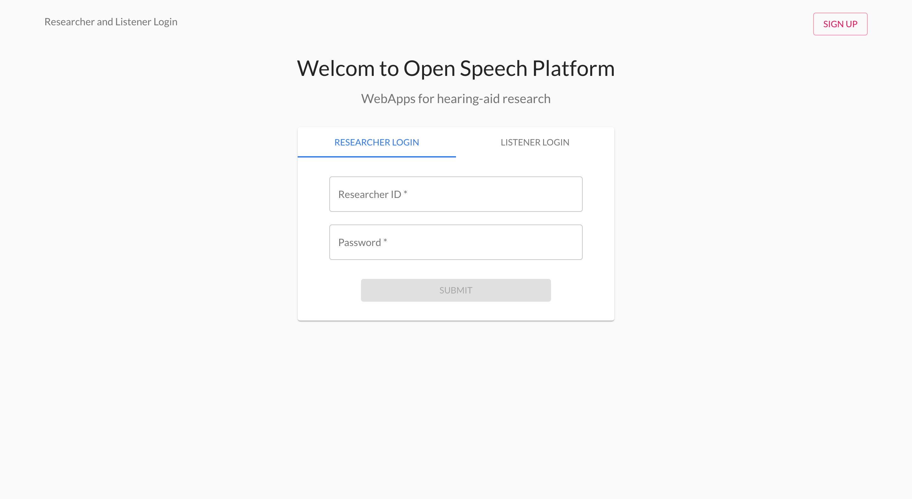
    <figcaption class="figcaption leftAlign">Figure 2.7: EWS (Node.js) Landing Page. You should see "Researcher Login" and "Listener Login", with input fields for "Researcher ID" and "password" and a red "Sign Up" button in the upper right corner.</figcaption>
</figure>

4. Proceed to make a new Researcher account by clicking on the "Sign Up" button. You should be able to enter a new name for your account as "Researcher ID" and a password to securely access your account. **Be sure to save your credentials in a place where you can remember them, as OSP does not currently have a feature to help you retrieve back your password!**

5. Login using your new credentials. You should successfully be logged in if your landing page looks like Figure [2.8](#figure2-8).

<figure id="figure2-8">
    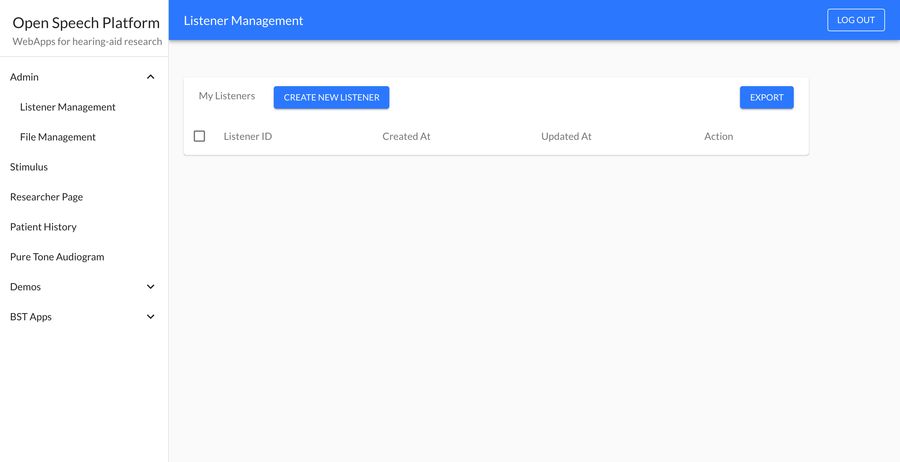
    <figcaption class="figcaption leftAlign">Figure 2.8: Once logged in, "Listener Management" is the page you should see. This page is under "Admin" in the left side of the screen.</figcaption>
</figure>

6. On the left side of the screen, you should see a list of text incorporating different aspects of EWS. Click on "Researcher Page", you should see many different settings, as Figure [2.9](#figure2-9) depicts.

<figure id="figure2-9">
    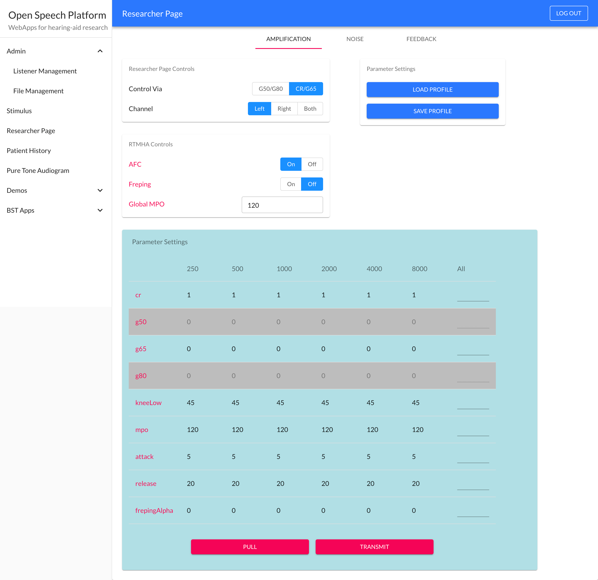
    <figcaption class="figcaption leftAlign">Figure 2.9: "Researcher Page". By default, you should see many controls and a table containing different audio parameters (cr, g50, mpo, etc.) and frequency band values (250 to 8000 Hertz).</figcaption>
</figure>

<mark class="yellowHighlight">
<b>Copied from section 2-3.</b><br><br>
7. You should be within the "Amplification" page. Pay attention to the
settings area labeled "Control via", which have buttons to toggle either
"G50/G80" or "CR/65". Choose "CR/G65".<br><br>
8. You can now change gains in individual bands by entering numerical
values for individual cells in the G65 row. In the G65/All cell, enter 5
for the value. You should see new values for RT-MHA highlighted.<br>
9. Wear your connected audio device. Press the "Transmit" button below
and listen. Your audio experience should be similar to when you entered
the `--gain -15` command in the terminal.<br><br>
10. Navigate to the terminal where you entered the osp command. Enter
`-p`. You will notice values for the different settings for both the left
and right audio channels: overall gain is -20, compression ratio (CR) is
1, and G65 is 5.<br><br>
11. Navigate back to the Researcher Page on your browser. You should still
be in the Amplification section. Navigate to the 3 cells corresponding
to the G65 row and columns 250, 500, and 1000. Enter -15 for each
cell. By setting this value for the 3 cells, you are setting a -15 dB
attenuation for the 250, 500, and 1000 Hz frequencies.<br><br>
12. Press the "Transmit" button below and listen. As a result of changing
these values, you will notice that the low frequency noise is significantly reduced. Depending on the headsets you are using, your experience might be different.
</mark>

&nbsp;  
### 2\-3 Test EWS \(PHP Version\)

1. For testing EWS, open two terminals side by side.
2. In the first terminal, type `osp`. In the second terminal, type `ews`.
3. Open a browser, such as Chrome. Enter `localhost:8080` in the search bar. You will see the landing page as shown in Figure [2.8](#figure2-8).
    
<figure id="figure2-8">
    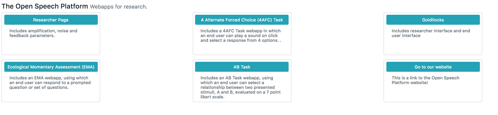
    <figcaption class="figcaption leftAlign">Figure 2.8: OSP Landing Page. Some of the apps are not yet connected to RT-MHA, but included here for early feedback on the user interface. These in progress web-apps are 4AFC and AB Task apps.</figcaption>
</figure>

4. There are several blue-green buttons with labels. Navigate and click the one labeled "Researcher Page". What you should see is the Researcher
Page interface, similar to Figure [2.9](#figure2-9).

<figure id="figure2-9">
    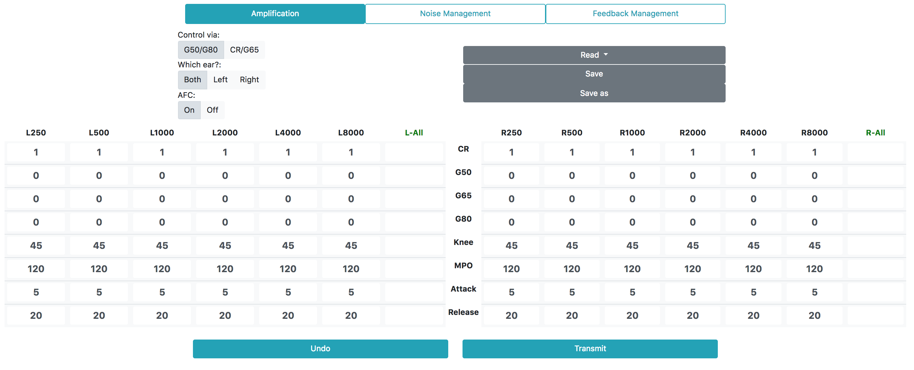
    <figcaption class="figcaption leftAlign">Figure 2.9: OSP Researcher Page. You can change Amplification, Noise Management and Feedback Management values from the first, second, and third tabs, respectively.</figcaption>
</figure>

5. You should be within the "Amplification" page. Pay attention to the
settings area labeled "Control via", which have buttons to toggle either
"G50/G80" or "CR/65". Choose "CR/G65".
6. You can now change gains in individual bands by entering numerical
values for individual cells in the G65 row. In the G65/All cell, enter 5
for the value. You should see new values for RT-MHA highlighted.
7. Wear your connected audio device. Press the "Transmit" button below
and listen. Your audio experience should be similar to when you entered
the `--gain -15` command in the terminal.
8. Navigate to the terminal where you entered the osp command. Enter
`-p`. You will notice values for the different settings for both the left
and right audio channels: overall gain is -20, compression ratio (CR) is
1, and G65 is 5.
9. Navigate back to the Researcher Page on your browser. You should still
be in the Amplification section. Navigate to the 3 cells corresponding
to the G65 row and columns 250, 500, and 1000. Enter -15 for each
cell. By setting this value for the 3 cells, you are setting a -15 dB
attenuation for the 250, 500, and 1000 Hz frequencies.
10. Press the "Transmit" button below and listen. As a result of changing
these values, you will notice that the low frequency noise is significantly reduced. Depending on the headsets you are using, your experience might be different.

<figure id="figure2-10">
    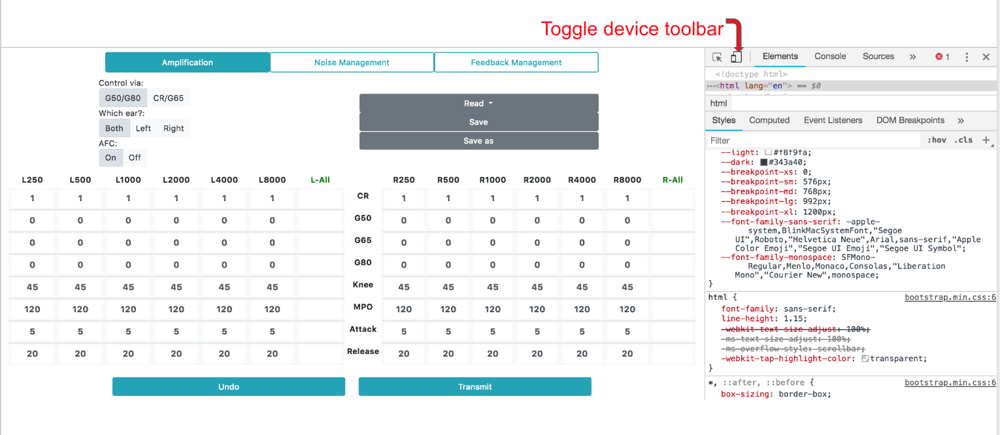
    <figcaption class="figcaption leftAlign">Figure 2.10: OSP Web Apps in Console Mode. If you are using a browser such as Chrome, you can right click in the browser window and choose Inspect. In this mode, you can view exchange of information between RT-MHA and the app. You can also change the app to be formatted for laptop and mobile devices using the Toggle Device Toolbar icon.</figcaption>
</figure>

&nbsp;
## 3 Release 2020a Development\: EWS \(Node.js version\)
##### \[[back to table of contents](#table-of-contents)]

**Note** - This chapter is still a work in progress and will be more complete in the next release.

This section is useful if you want to perform development on the Node.js
version of the EWS. **Please make sure that you have all the necessary
packages installed in your computer before moving forward with
this section. Otherwise, go back to [1.3.1](#1\-3\-1-installing-everything-\--rt\-mha-and-nodejs-version-of-ews) or [1.3.4](#1\-3\-4-installingupdating-just-the-nodejs-version-of-ews) to either install
OSP and EWS - Node.js version or just EWS - Node.js version.**

Now you have the following options:  
1. **Executing the Compiled Node\.js Backend**  
Run the command `./ews njs`. This will install the Node.js version of EWS on your system (which also contains the frontend) and will automatically execute the Node.js backend.
2. **Executing just the Node\.js backend**  
Run the command `ews-backend`. This will execute the Node.js backend
from the `/user/local/bin` directory where it has been installed.
3. **Executing just the Node\.js frontend**
Run the command `ews-frontend`. This will execute the Node.js frontend
from the local `/osp-release-staging/Software` directory.
4. **Executing the Node\.js backend in development mode**  
Run the command `ews njs dev`. This will execute the Node.js backend
in live development mode(using watch), any changes you make to the
backend will be instantly reflected live in the webpages and recompiled
to the backend \(**Note: This code will not compile the frontend
into the backend, for that you will need to run the script in
step 1**\)
&nbsp;   

